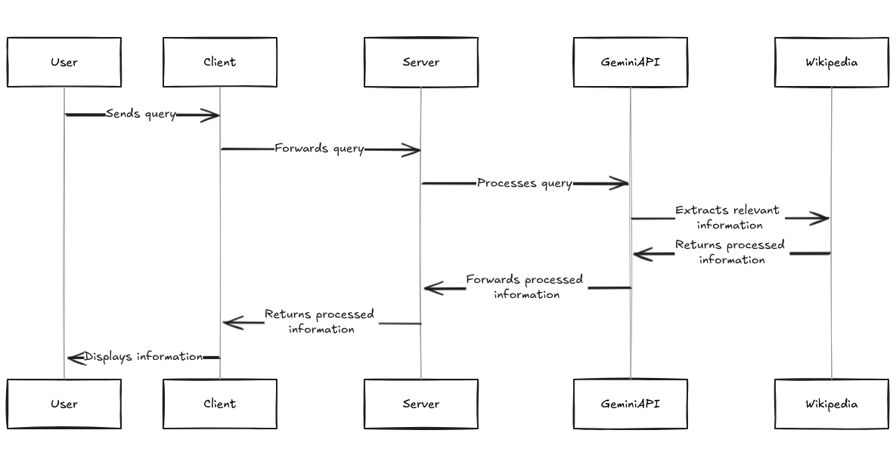

<p align="center">

</p>

<p align="center" style="margin-bottom: 50px">
<a href="https://github.com/Cloud-Hacks/wikibot-ai/issues">
        </a>
    <a href="https://github.com/Cloud-Hacks/wikibot-ai/network/members" alt="Forks">
        </a>
    <a href="https://github.com/Cloud-Hacks/wikibot-ai/stargazers" alt="Stars">
        </a>
    <a href="https://github.com/Cloud-Hacks/wikibot-ai/graphs/contributors">
        </a>
    <a href="https://github.com/Cloud-Hacks/wikibot-ai/blob/main/LICENSE">
        </a>
    <a href="https://ai.google.dev/">
        </a>
</p>

# Table of contents

<!--ts-->
   * [Project Overview](#Overview)
   * [Features](#Features)
      * [App Architecture](#App-Architecture) :TODO
   * [Prerequisites](#Prerequisites)
   * [Project Setup](#Installation)
   * [Contributing](#Contributing)
<!--te-->


## Overview  
WikiBot AI leverages the Gemini Flask model to enhance query search capabilities. This intelligent assistant is designed to help users navigate and extract information from Wikipedia efficiently. By utilizing advanced natural language processing, WikiBot AI allows users to query Wikipedia in plain English and receive accurate, relevant information quickly. Whether you need quick facts, detailed explanations, or summaries of complex topics, WikiBot AI is here to assist you.

## Features 
- **Natural Language Querying**: Search for information using plain English queries. For example, ask "What is the capital of France?" or "Tell me about the history of the internet."
- **Advanced NLP**: Utilizes state-of-the-art natural language processing to understand and respond to user queries accurately.
- **Contextual Understanding**: Provides detailed and contextually relevant information based on the user's query.
- **User-Friendly Interface**: Easy-to-use interface that makes information retrieval from Wikipedia seamless and efficient.
- **Real-Time Updates**: Ensures that the information provided is up-to-date by fetching the latest data from Wikipedia.
- **Enhanced Query Search**: Leverages the Gemini Flask model to improve the accuracy and relevance of search results.

## App Architecture




## Prerequisites 🛠️
Before you begin, ensure you have the following installed on your machine:  
- Python 3.8+
- Git
- Virtual Environment (Optional but recommended)  
   
## Installation ⚙️
1. Clone the Repository  
```bash
git clone https://github.com/Cloud-Hacks/wikibot-ai.git  
cd wikibot-ai`
```
2. Set Up a Virtual Environment (Optional but Recommended)  
```bash
python -m venv venv  
source venv/bin/activate  # On Windows, use `venv\Scripts\activate`
```
3. Install Dependencies  
```bash
pip install -r requirements.txt
```
4. Set up your `secrets.toml` file under `.streamlit` directory and copy `example.secrets.toml` into `secrets.toml` and replace the keys
```
GEMINI_API_KEY="<your-gemini-api-key>"
```

## Contributing 🤝
Contributions to this project are welcome! If you find any issues or have suggestions for improvement, please open an issue or submit a pull request on the project's GitHub repository.

## License 📝
This project is licensed under the [MIT License](https://github.com/Cloud-Hacks/wikibot-ai/main/LICENSE). Feel free to use, modify, and distribute the code as per the terms of the license.
Ref: https://ai.google.dev/competition
